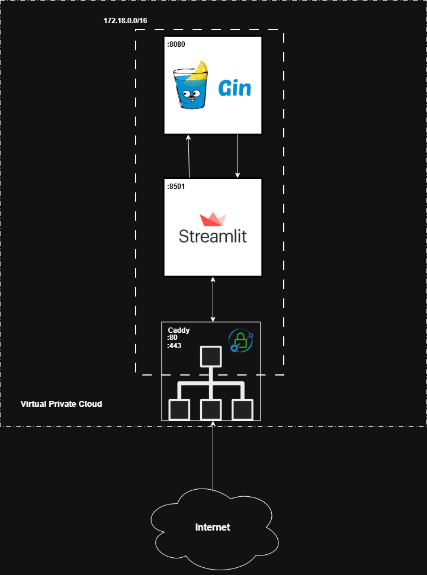

# Asql

A systems programming project that explores the fundamentals of compilers, applying the knowledge earned in the `Systems Programming 2026` course.

## Project Stages

- [x] **Lexer:** Developed a tokenizer and lexer rules to differentiate tokens that belong to the syntactic table from those that do not.
- [ ] **Parser:** Build a parser and an AST (Abstract Syntax Tree) to determine the correct token sequence and verify that the grammar is correct.
- [ ] **Semantics:** Implementation of a semantic checker to detect compilation errors and type verification.
- [ ] **Optimization:** Final stage of the project where language ambiguities will be addressed and overall performance will be optimized.

## Architecture



## Usage

### Deploy

make a `.env` file and set these environment variables:
```
CADDYFILE=Caddy/Caddyfile
MODE=release
CLOUDFLARE_API_TOKEN=
```
To start the deploy, just run:
```
docker compose up -d
```
### Develop

```
CADDYFILE=Caddy/Caddyfile.dev
```
#### Asql-app

Manually start the `asql-app` gin HTTP server
```sh
make server
```
you can configure the listening `port` and `host` as shown below
```
HOST=localhost
PORT=9999
```

To manually start the `asql-streamlit` frontend server

_Note: you must create a virtual environment with python and install requirements.txt_
```sh
streamlit run streamlit/app.py
```
_More technical implementation details will be recorded in this same file for future reference or to showcase the work done throughout this course._
